# dev-badge

[](https://github.com/milankomaj/dev-badge)

> ##### live [example](https://milankomaj.github.io/site-dev-badge)      |    build your owns

---

> #### Build`s on Github.

```mermaid
%%{init: {'theme': 'neutral', 'themeVariables': { 'fontSize': '18px'}}}%%
%%{ init: { 'flowchart': { 'curve': 'stepAfter' } } }%%
flowchart LR

A>Build`s on Github.] ==>|"#10067;"| B
X("secrets") .->B(("🟢"))
B(("🟢")) .->C("Deploy with Workers")
B(("🟢")) .->D("Fork repositori")
B(("🟢")) .->E("Use this template")
C & D & E -...->|"additional steps"| F("Run workflow") 

style F fill:#f6f8fa,stroke:#333,stroke-width:2px
style C fill:#404242,color:#fefefe
style D fill:#f6f8fa,stroke:#e9eaec
style E fill:#2da44e,stroke-width:0px,color:#ffffff
style F fill:#f6f8fa,stroke:#e9eaec
style A fill:#0969da,stroke:#333,stroke-width:2px,color:#fff,stroke-dasharray: 2 2

click A "https://github.com/milankomaj/dev-badge"
click D "https://github.com/milankomaj/dev-badge/fork"
click E "https://github.com/milankomaj/dev-badge/generate"


```

> [](https://deploy.workers.cloudflare.com/?url=https://github.com/milankomaj/dev-badge)



> [](https://github.com/milankomaj/dev-badge/actions/workflows/deploy.yml)

---

> #### Build localy.
> - [ ] Start[^note]
> - 1️⃣ clone/download [repository](https://github.com/milankomaj/dev-badge)
> - 2️⃣ npm install ```  npm run NpmInstall  ``` 
> - 3️⃣ [development:](/)
>   - ```  npm run dev  ``` 
>   - or ```  npm run local  ``` 
>   - or ```  npm run miniflare  ```      
>   - complete your secrets/keys in [*.dev.vars*](/.dev.vars) file[^1]
>     - ```  localhost:8787  ``` 
> - 4️⃣ [production:](/)
>   - ```  npm run pro  ``` 
>     - ```  localhost:8787  ```
>   - complete your secrets/keys in [*example.secrets.json*](/example.secrets.json) file[^1]   
> - 5️⃣ [publish:](/)
>   - ```  npm run deploy  ``` 
>   - or ```  wrangler publish  ```  
> - [x] Done

[^1]: some services/mods need secrets/keys 🗝️
[^note]:
    prerequisites: *node, npm, wrangler*

 ---  
 > ##### Credits and similar projects: [*badgen*](https://github.com/badgen/badgen.net), [*webadge*](https://github.com/tuananh/webadge.dev), [*shields*](https://github.com/badges/shields)   

