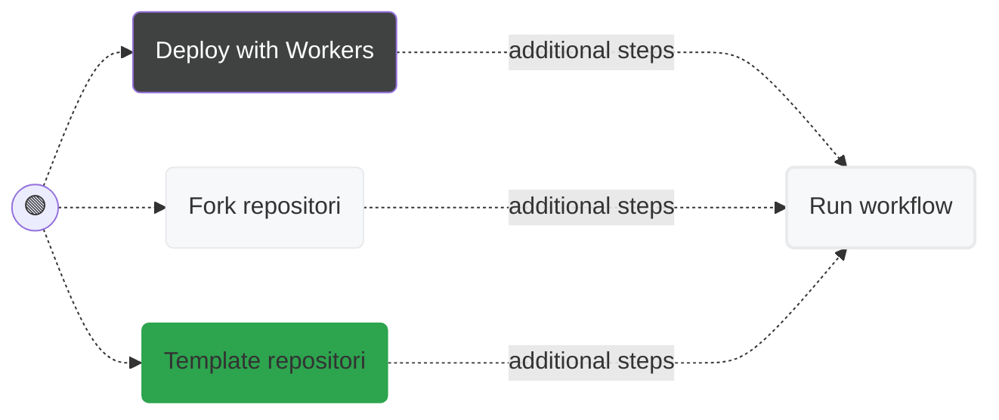

# dev-badge

---

> #### Build`s on Github.
> 

```mermaid
flowchart LR

B(("🟢")) .->C("Deploy with Workers")
B(("🟢")) .->D("Fork repositori")
B(("🟢")) .->E("Template repositori")
C & D & E -...->|additional steps| F("Run workflow") 


style F fill:#f6f8fa,stroke:#333,stroke-width:2px
style C fill:#404242,color:#fefefe
style D fill:#f6f8fa,stroke:#e9eaec
style E fill:#2da44e,stroke-width:0px
style F fill:#f6f8fa,stroke:#e9eaec

click D "https://github.com/milankomaj/dev-badge/fork"
click E "https://github.com/milankomaj/dev-badge/generate"


```

> 

---

> #### Build localy.

---
