# dev-badge

[](https://github.com/milankomaj/dev-badge)

> ##### live [example](https://milankomaj.github.io/site-dev-badge) preview     |    create your owns

---

> #### Build`s on Github.

```mermaid
%%{init: {'theme': 'neutral', 'themeVariables': { 'fontSize': '18px'}}}%%
%%{ init: { 'flowchart': { 'curve': 'stepAfter' } } }%%
flowchart LR

A>Build`s on Github.] ==> |"#10067;"| B
X("secrets/keys") .->|"{#133;}"|B(("🟢"))
G("#10094;#10095;  Code #9207; Codespaces") <.-> B(("🟢"))
B(("🟢")) --> C("Deploy with Workers")
B(("🟢")) --> D("#10971; Fork #9207; ")
B(("🟢")) --> E("Use this template #9207;")
C & D & E -..-> |"additional steps"| F("Run workflow")


style F fill:#f6f8fa,stroke:#333,stroke-width:2px
style C fill:#404242,color:#fefefe
style D fill:#f6f8fa,stroke:#e9eaec
style E fill:#2da44e,stroke-width:0px,color:#ffffff
style F fill:#f6f8fa,stroke:#e9eaec
style G fill:#f6f8fa,stroke:#d1d2d4,stroke-width:2px
style A fill:#0969da,stroke:#333,stroke-width:2px,color:#fff,stroke-dasharray: 2 2

click A "https://github.com/milankomaj/dev-badge"
click D "https://github.com/milankomaj/dev-badge/fork"
click E "https://github.com/milankomaj/dev-badge/generate"
click G "https://github.com/codespaces"


```

> [](https://deploy.workers.cloudflare.com/?url=https://github.com/milankomaj/dev-badge)



> [](https://github.com/milankomaj/dev-badge/actions/workflows/deploy.yml)

---

> #### Build localy.
> - [ ] **Start**  [^note]
> - :one: clone/download [repository](https://github.com/milankomaj/dev-badge)
> - :two: ``` npm install  ```  or   ```  npm run NpmInstall  ```  [:link:](/package.json#L11)
> - :three: [**development:**](/package.json)
>   - complete your secrets/keys in [*.dev.vars*](/.dev.vars) file  [^1]
>   - ```  npm run dev  ```  [:link:](/package.json#L7)
>   - or ```  wrangler dev  ```
>     -   [*localhost:8787*](//localhost:8787)
> - :four: [**production:**](/package.json#L8)
>   - complete your secrets/keys in [*example.secrets.json*](/example.secrets.json) file  [^1]
>   - ```  npm run pro  ```   [:link:](/package.json#L8)
>   - or ```  wrangler dev --remote  ```
>     -   [*localhost:8787*](//localhost:8787)
> - :five: [**publish:**](/package.json)
>   - ```  npm run publish  ```   [:link:](/package.json#L10)
>   - or ```  wrangler deploy  ```
> - [x] **Done**

[^1]: some services/[*mods*](dev-badge/tree/master/mods) need secrets/keys :key:
[^note]:
    prerequisites: [*node*](https://nodejs.org), [*npm*](https://www.npmjs.com/), [*wrangler* (>= 3.0.0)](https://workers.cloudflare.com/)

 ---
 > ##### related and similar projects: [*badgen*](https://github.com/badgen/badgen.net), [*webadge* 游륳(https://github.com/tuananh/webadge.dev), [*shields*](https://github.com/badges/shields)
